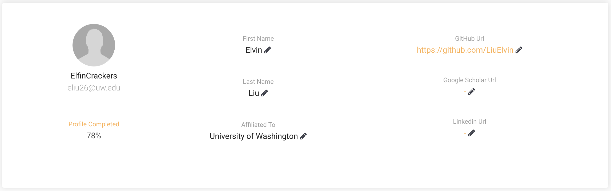
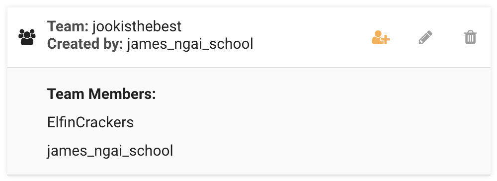
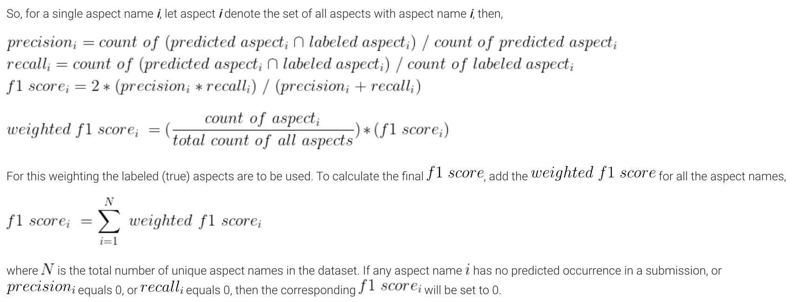
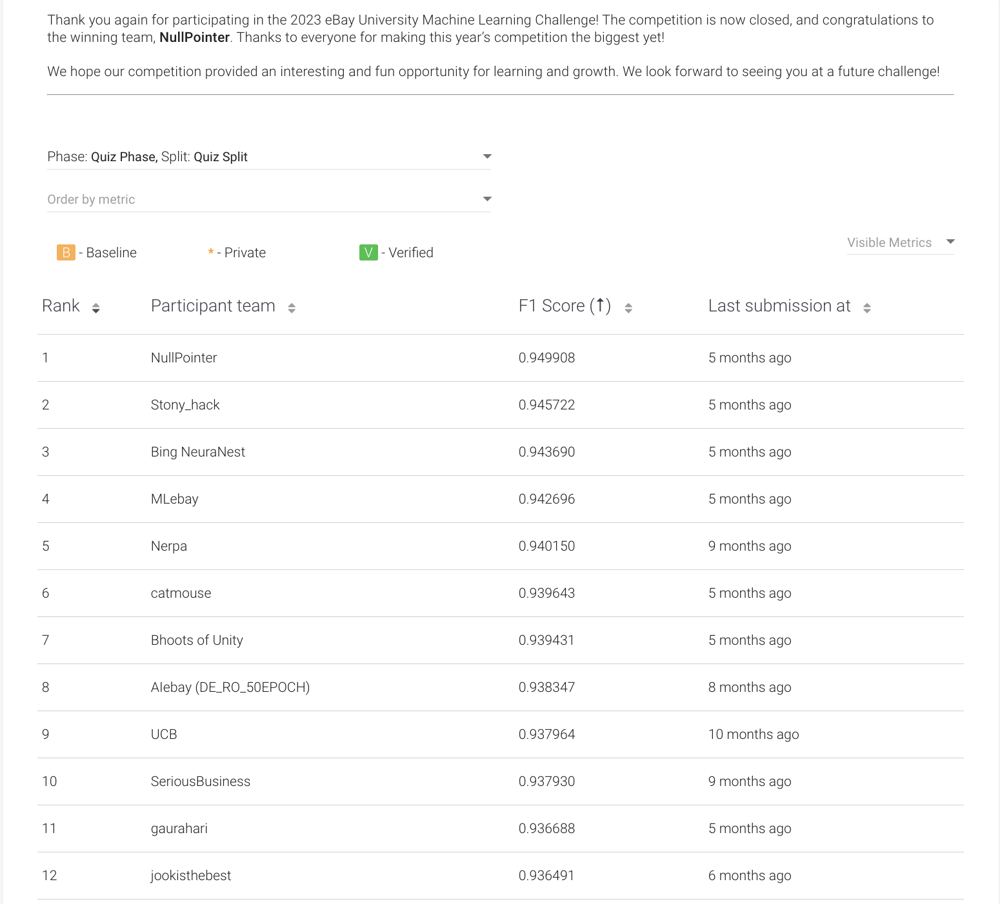
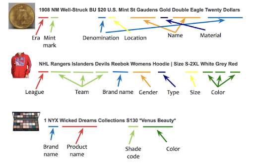
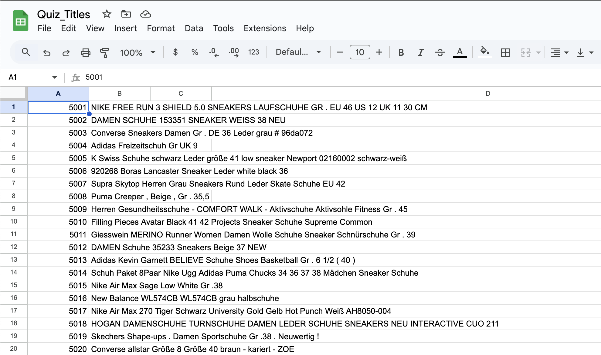
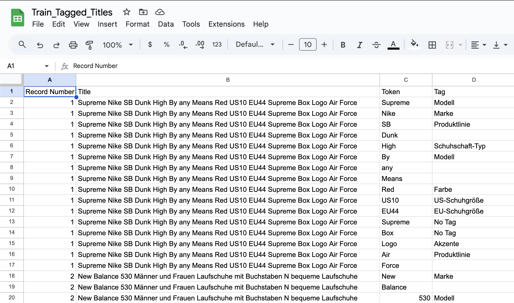
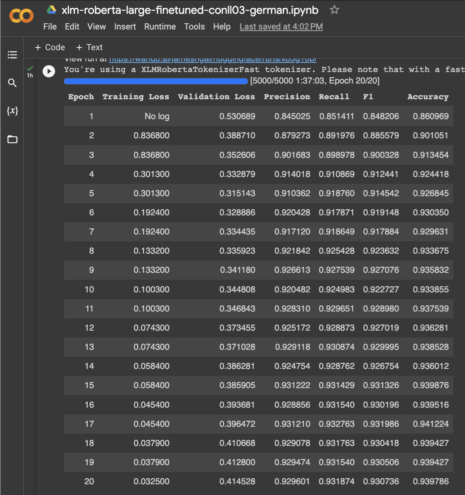
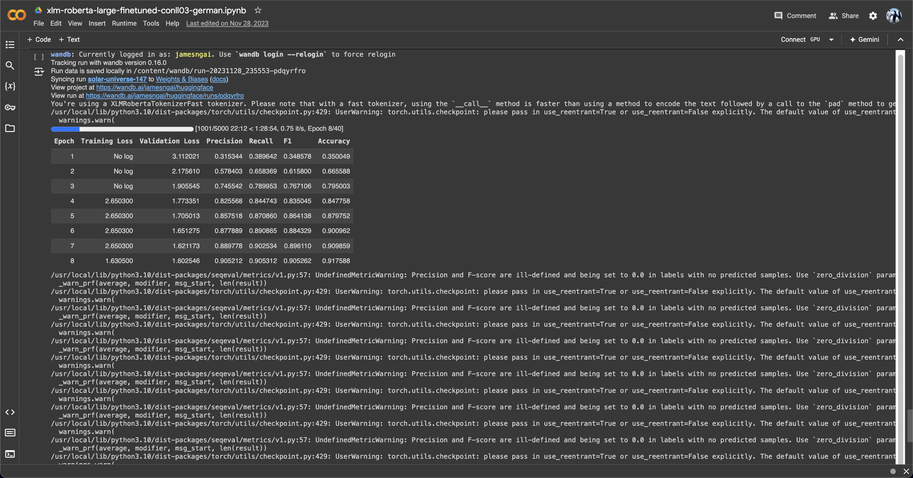
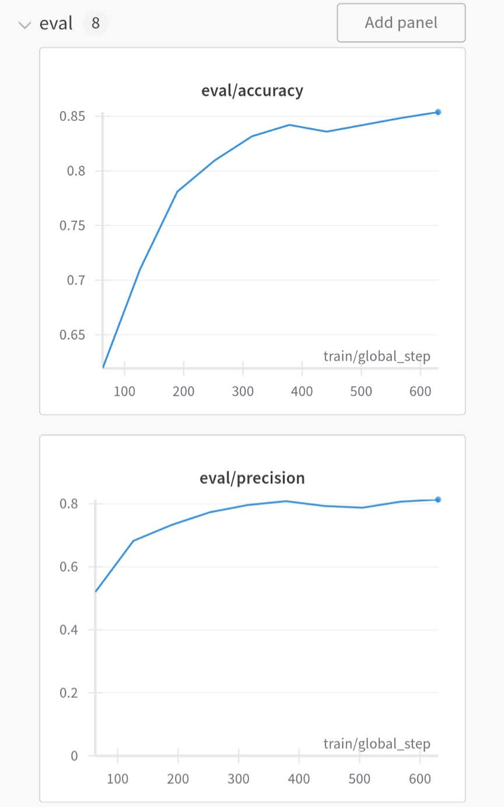

# eBay 2023 University Machine Learning Competition

## May 2023 - December 2023

---

### Summary

In the summer of my freshman year, my friend, [James Ngai](https://www.linkedin.com/in/ngai-james), and I competed under the team name **jookisthebest** at eBay's 5th Annual University Challenge in the space of Machine Learning on an e-commerce dataset. The competition primarily targets master's and PhD students, however undergraduate students were also encouraged to participate (as long as we had a team of 1 to 5 people).

  
  

The competition asked us to build a machine learning model that could accurately extract and label the named entities in the dataset of item titles on eBay's German site.

Each team's submitted models were evaluated using the test dataset, with the team achieving the highest weighted f1-score (indicating the best predictions) on this dataset declared the winner. The quiz dataset was used for leaderboard scoring. Further details about the weighted f1-score are provided here:

  

Our team, **jookisthebest**, placed **12th place** out of **887 teams** and 1439 participants. The final leaderboard results are shown below:

  

---

## Links

- The competition overview, specifications, and leaderboard can all be found [here](https://eval.ai/web/challenges/challenge-page/2014/overview)

- More detailed information regarding the participants and winners can be found at the [link](https://innovation.ebayinc.com/tech/features/meet-the-winners-of-the-5th-ebay-university-machine-learning-challenge/)

## Files

Files for my [Project 1 repository](https://github.com/LiuElvin/eBay_ML_Challenge/tree/main).

- [`./models`](./models) includes code for the XLM-RoBERTa model.

*Note:* Most of the `Python` coding for this project was conducted on Google Colab. The model provided in the [`./models`](./models) folder represents just one of the many machine learning models developed during the competition. Due to the need to redact sensitive information, such as password keys, before uploading the code to GitHub, I have only included example code for the XLM-RoBERTa model. This model serves as a representative example of our later submissions, as the code structure had become fairly streamlined by the end of the competition.

## Background

Named Entities are the semantic strings / words / phrases that refer to people, brands, organizations, locations, styles, materials, patterns, product names, units of measure, clothing sizes, etc.

Named Entity Recognition (NER) is the machine learning process of automatic labeling and extracting important named entities in a text that carry a particular meaning. In e-commerce, NER is used to process listing or product titles and descriptions, queries, and reviews, or wherever extraction of important data from raw text is desired. At eBay, NER is applied in a variety of applications, in particular for extracting aspects from listings (seller-facing context), and from search queries (buyer-facing context). In both of these contexts NER plays a crucial role to bridge unstructured text data to structured data.

For this challenge, eBay listing titles are used for NER. A few examples of NER labeling of listing titles are shown below (these examples are in English to illustrate the concept, the challenge data used German language listing titles).

  

Extracted entities, also called aspects, consist of the aspect name (“Brand name” for the first aspect in the last example above) and the aspect value (“NYX” for the same aspect in the same example above). The objective of this challenge is to extract and label the aspects in the dataset of item titles listed on eBay. Not all titles have all aspects, and figuring out which aspect is present for a given title is a significant part of the challenge.

## Dataset

The dataset consists of 10 million randomly selected unlabeled item titles from eBay Germany, all of which are from “Athletic Shoes” categories.

- Among these item titles there are 10,000 labeled item titles

- The set of aspect names that should be extracted from each item title is also provided

- Each item title contains a unique identifier (a record number)

The 10,000 labeled item titles will be split into three groups:

1. Training set (5,000 records)
2. Quiz set (2,500 records)
3. Test set (2,500 records)
 

  

  

20 unlabeled item titles from eBay Germany are pictured above.

- The top image depicts raw quiz data

- The bottom image depicts a model's predicted labels

## The Model

Our project involves training a token classification model using Hugging Face's transformers library and other key tools. Below is a structured outline of the approach:

### Components -

**1. Tokenizing German eBay Listings**

- Incorporated Facebook A.I.'s RoBERTa model to tokenize German eBay listings effectively

- Pre-processed symbols to manually remove untranslatable text

**2. Performance Tracking and Storage**

- Set up Hugging Face and Wandb integrations to store and track model performance for easy evaluation of past experiments

  
  

Above are 2 sample runs (1 successful, 1 unsuccessful) of the training loop on Google Colab.

### Workflow -

**1. Dataset Handling**

- Used the datasets library from Hugging Face to load, manage, and preprocess the dataset directly in Google Colab

**2. Loading Pre-trained Token Classification Model**

- Loaded a pre-trained model using the transformers library for token classification tasks

- Tokenized the dataset with the AutoTokenizer class

**3. Model Training**

- Trained the model using PyTorch, employing:

  - Custom optimization with the AdamW optimizer
  
  - Learning rate schedulers for better convergence
  
- Training progress and metrics were logged in Wandb

**4. Performance Metrics**

- Computed evaluation metrics such as precision, recall, f1-score, and accuracy during training and at the end of each epoch

- Used the seqeval library to calculate token-level performance metrics

**5. Data Preparation**

- Loaded and processed training and evaluation datasets using PyTorch’s DataLoader class

This setup allowed us to efficiently train and evaluate the model while maintaining detailed performance logs for iteration and improvement

Below is a Wandb performance graph for step size.

  

---

## Contributions

- My teammate, James Ngai, performed pre-processing for indecipherable and unrecognizeable symbols

- James also produced a majority of the code chunks involving PyTorch and Wandb

- Because we were both initially novices in the machine learning space, most of my work consisted of experimenting with the Hugging Face library and implementing the training loop

- To train models on GPUs, I set up multiple AWS and Google Cloud cloud service accounts

- I tested the hyperparameters (epochs, learning rate, etc.) for our machine learning models, tweaking values based off the trends shown by the Wandb performance graphs

- Facebook A.I.'s RoBERTa multilingual model provided both token classification and translation for our final submission

  - A link to the model can be found [here](https://huggingface.co/FacebookAI/xlm-roberta-large-finetuned-conll03-english)

## Learning Outcomes

- Implemented `Python` code, particularly from machine learning libraries such as PyTorch, Wandb, and Hugging Face

- Utilized theoretical machine learning concepts to optimize hyperparameter tuning

- Leveraged and set up cloud services like AWS and Google Cloud for model training

- Learnt the under the hood mechanisms behind neural networks
