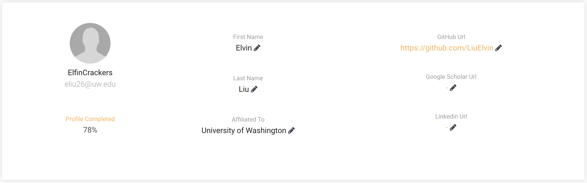
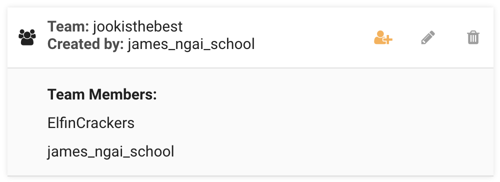
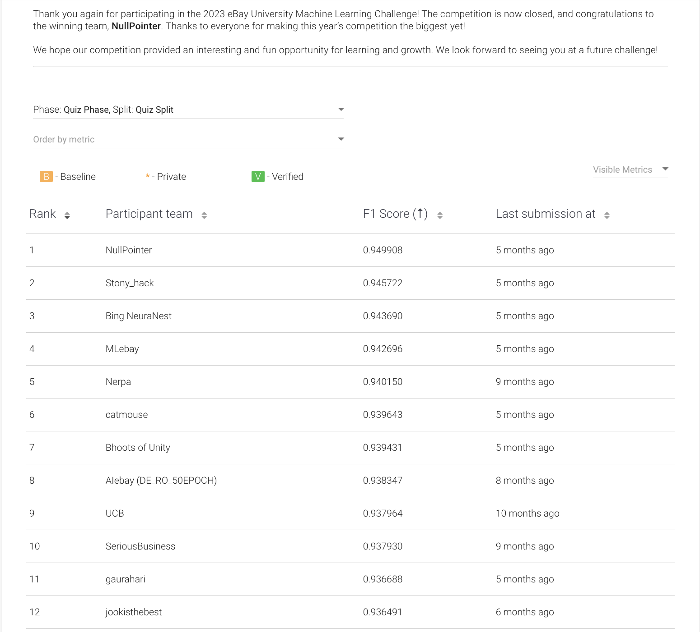

# eBay 2023 University Machine Learning Competition

- During my freshmen summer, my friend (James Ngai) and I tried our hand at eBay's 5th Annual University Challenge in the space of Machine Learning on an e-commerce dataset.

  
  

- While the competition is primarily geared toward graduate students, including Ph.D., undergrad students can also participate, in teams of 1 to 5 students.

- This year, we were asked to build a model that can accurately extract and label the named entities in the dataset of item titles on eBay.

- Our team, `jookisthebest` placed 12th place out of 887 teams and 1439 participants.

---

The link to the competition overview, specifications, and leaderboard can be found [here](https://eval.ai/web/challenges/challenge-page/2014/overview).

More detailed information about the winners and participants can be found [here](https://innovation.ebayinc.com/tech/features/meet-the-winners-of-the-5th-ebay-university-machine-learning-challenge/).

---

# General Information

- Build a model that can accurately extract and label the named entities in the dataset of item titles on eBay. Named Entities are the semantic strings/words/phrases that refer to people, brands, organizations, locations, styles, materials, patterns, product names, units of measure, clothing sizes, etc.

- Named Entity Recognition (NER) is the machine learning process of automatic labeling and extracting important named entities in a text that carry a particular meaning. In e-commerce, NER is used to process listing or product titles and descriptions, queries, and reviews, or wherever extraction of important data from raw text is desired.

- The data is from listings on eBay’s German site.

- Performance of the model for each aspect name is graded using weighted precision, recall and f1-score. The aspects will be weighted by their count in the quiz or test dataset. The final precision, recall and the final combined f1-score are calculated by adding the individual weighted aspect name f1-scores.

# The Model

- Our team `jookisthebest` placed 12th out of 887 teams.

- Incorporated Facebook's RoBERTa model to tokenize German.

- Includes some manual pre-processing so symbols can be understood.

- The original scripts are stored elsewhere for accessability and privacy reasons (HuggingFace and Wandb logins).

- The model trains a token classification model using Hugging Face's Transformers library. Here's a more in-depth summary of what the code does:
  1. The datasets library is used to load and handle the dataset.

  2. Hugging Face's transformers library is utilized to load a pre-trained token classification model.

  3. The AutoTokenizer class from transformers is employed to tokenize the dataset.

  4. The model is trained using PyTorch.
    - PyTorch's torch library is used for neural network operations.
    - The training loop is implemented with custom optimization strategies using AdamW optimizer and learning rate schedulers.
    - Training progress is logged using weights & biases (wandb).

  5. Model performance metrics like precision, recall, F1-score, and accuracy are computed during training and evaluation.
    - Evaluation metrics are computed using the seqeval library.

  6. Training and evaluation data are loaded and processed using PyTorch's DataLoader.

  7. Experiment logging is performed using Weights & Biases (wandb).

# Miscellaneous Information

1. Named entity recognition (NER) is a fundamental task in Natural Language Processing (NLP) and one of the first stages in many language understanding tasks. It has drawn research attention for a few decades, and its importance has been well recognized in both academia and industry.

3. The extracted entities are also called aspects, and an aspect consists of the aspect name (“Brand name” for the first aspect in the last example above) and the aspect value (“NYX” for the same aspect in the same example above). The objective of this challenge then is to extract and label the aspects in the dataset of item titles listed on eBay. Not all titles have all aspects, and figuring out which aspect is present for a given title is part of the challenge.

# Data

The data set consists of 10 million randomly selected unlabeled item titles from eBay Germany, all of which are from “Athletic Shoes” categories. Among these item titles there will be 10,000 labeled item titles (“labeled” means the aspects have been extracted). There will also be an annexure document provided that describes the dataset. Finally, we will provide the set of aspect names that should be extracted from each item title (as stated before, not all titles have all aspects). Each item title will have a unique identifier (a record number).

The 10,000 labeled item titles will be split into three groups:

Training set (5,000 records)
Quiz set (2,500 records)
Test set (2,500 records)
The 10 million unlabeled title set and the training set is intended for participants to build their models/prediction system. The actual aspects will be provided for each item title in the training set, along with the item title record number to link the aspects to the title.

---

# Contributions

- My teamates, James Ngai, produced a majority of the coding portions utilizing PyTorch and Wandb.

- We were both novices in the Machine Learning space, so most of my work consisted of experimentation of whatever features HuggingFace could provide.

- I ended up testing the hyperparameters (epochs, learning rate, etc.) for our models, tweaking them based off the graphs provided by Wandb.

- I also set up cloud services like AWS and Google Cloud for model training on GPUs.

- The translation task would've been impossible without Facebook A.I.'s RoBERTa multilingual model. Link [here](https://huggingface.co/FacebookAI/xlm-roberta-large-finetuned-conll03-english).

# Learning Outcomes

- Essentially every topic introduced during this project was new to me. I initially wasn't familiar with Machine Learning at all.

- I learnt a lot of Python code, specifically those relating to Machine Learning libraries like PyTorch, Wandb, and HuggingFace.

- I gained increased familiarity with Neural Networks and their corresponding hyperparameters for tuning.

- Learnt to use Google Cloud and AWS for model training (also a lot of back and forth emails with HR for increased GPU usage limits).
