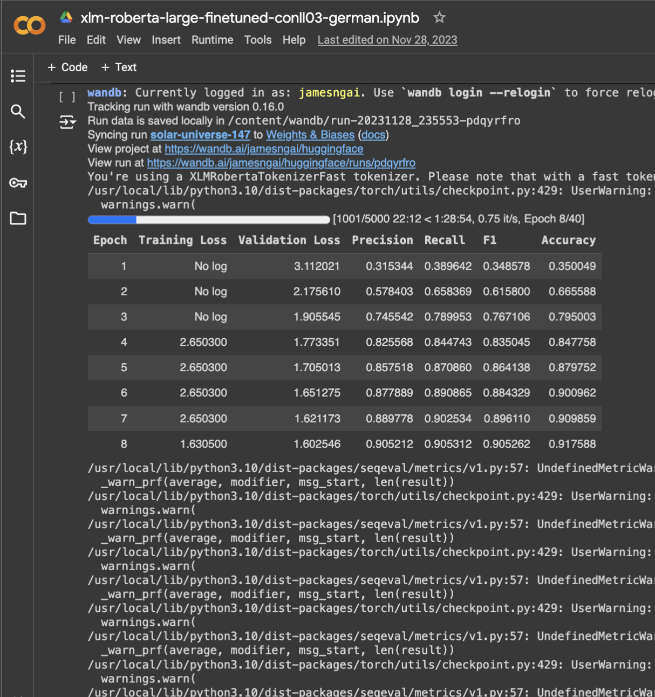

# eBay 2023 University Machine Learning Competition

During my freshmen summer, my friend (James Ngai) and I tried our hand at eBay's 5th Annual University Challenge in the space of Machine Learning on an e-commerce dataset.

  
  

While the competition is primarily geared toward teams of 1 to 5 graduate students, including Ph.D., undergrad students can also participate.

This year, we were asked to build an ML model that can accurately extract and label the named entities in the dataset of item titles on eBay.

Most of our work was done on Google Colab, so the model in the `models` folder is just one of the many models we went through. There's a decent bit of sensitive information in the keys so that's the only model I'll have uploaded.

Our team, `jookisthebest` placed **12th place** out of **887 teams** and 1439 participants.

---

The link to the competition overview, specifications, and leaderboard can be found [here](https://eval.ai/web/challenges/challenge-page/2014/overview).

More detailed information about the winners and participants can be found [here](https://innovation.ebayinc.com/tech/features/meet-the-winners-of-the-5th-ebay-university-machine-learning-challenge/).

---

# Background

- Named Entities are the semantic strings/words/phrases that refer to people, brands, organizations, locations, styles, materials, patterns, product names, units of measure, clothing sizes, etc.

- Named Entity Recognition (NER) is the machine learning process of automatic labeling and extracting important named entities in a text that carry a particular meaning. In e-commerce, NER is used to process listing or product titles and descriptions, queries, and reviews, or wherever extraction of important data from raw text is desired.

- At eBay, NER is applied in a variety of applications, in particular for extracting aspects from listings (seller-facing context), and from search queries (buyer-facing context).

  - In both of these contexts NER plays a crucial role to bridge unstructured text data to structured data. This challenge focuses on extraction from listings.

# The Challenge

We, the university student teams, need to use the provided data (from eBay’s German site) to solve a real-world e-commerce challenge.

While NER is applied in many different settings, for this challenge, NER is applied to eBay listing titles.

A few examples of NER labeling of listing titles are shown below (these examples are in English to illustrate the concept, the challenge data will have German language listing titles).

The extracted entities are also called aspects, and an aspect consists of the aspect name (“Brand name” for the first aspect in the last example above) and the aspect value (“NYX” for the same aspect in the same example above).

The objective of this challenge is to extract and label the aspects in the dataset of item titles listed on eBay.

  - Not all titles have all aspects, and figuring out which aspect is present for a given title is part of the challenge.

The team with the highest weighted precision (recall and f1-score) on the test dataset wins.

The weighted f1-score and its components are explained in more detail in the image below.

  

# The Model

  
  

Above are 2 runs (1 successful and 1 failed) of our models on Google Colab.

In our model, we

- Incorporated Facebook A.I.'s RoBERTa model to tokenize German eBay listings.

- Included pre-processing of certain symbols to manually remove untranslatable text.

- Setup Hugging Face and Wandb folders to store and freely assess performances of previous models.

The model trains a token classification model using Hugging Face's transformers library. More specifically...

1. We utilize the datasets library to load and handle the dataset into Google Colab.
 
2. Hugging Face's transformers library is then necessary to load a pre-trained token classification model.
 
3. The AutoTokenizer class from the transformers library is employed to tokenize the dataset.
 
4. The model is trained via PyTorch.
 
  - We use the neural network operations.

  - We implement a training loop with custom optimization strategies from the AdamW optimizer and learning rate schedulers.
 
  - Training progress is logged via Wandb.
 
5. Model performance metrics like precision, recall, f1-score, and accuracy are computing during training and evaluation of epochs.

  - Evaluation metrics are computed with the seqeval library.
    
6. Training and evaluation data is then loaded and processed via PyTorch's DataLoader.

  

# Dataset

- Reflecting eBay’s international character, the data is from a non-English site.

- The data set consists of 10 million randomly selected unlabeled item titles from eBay Germany, all of which are from “Athletic Shoes” categories.

  - Among these item titles there are 10,000 labeled item titles.

  - We were also provided the set of aspect names that should be extracted from each item title.

  - Each item title had a unique identifier (a record number).
 

  
  

- The above image depicts 20 example unlabeled item titles from eBay Germany.

  - The left is the raw data, while the right is the model's predicted labels.

- The 10,000 labeled item titles will be split into three groups:

  1. Training set (5,000 records)
  2. Quiz set (2,500 records)
  3. Test set (2,500 records)

---

# Contributions

- My teamates, James Ngai, produced a majority of the coding portions utilizing PyTorch and Wandb.

- We were both novices in the Machine Learning space, so most of my work consisted of experimentation of whatever features Hugging Face could provide.

- I ended up testing the hyperparameters (epochs, learning rate, etc.) for our models, tweaking them based off the graphs provided by Wandb.

- I also set up cloud services like AWS and Google Cloud for model training on GPUs.

- The translation task would've been impossible without Facebook A.I.'s RoBERTa multilingual model. Link [here](https://huggingface.co/FacebookAI/xlm-roberta-large-finetuned-conll03-english).

# Learning Outcomes

- Essentially every topic introduced during this project was new to me. I initially wasn't familiar with Machine Learning at all.

- I learnt a lot of Python code, specifically those relating to Machine Learning libraries like PyTorch, Wandb, and Hugging Face.

- I gained increased familiarity with Neural Networks and their corresponding hyperparameters for tuning.

- Learnt to use Google Cloud and AWS for model training (also a lot of back and forth emails with HR for increased GPU usage limits).
